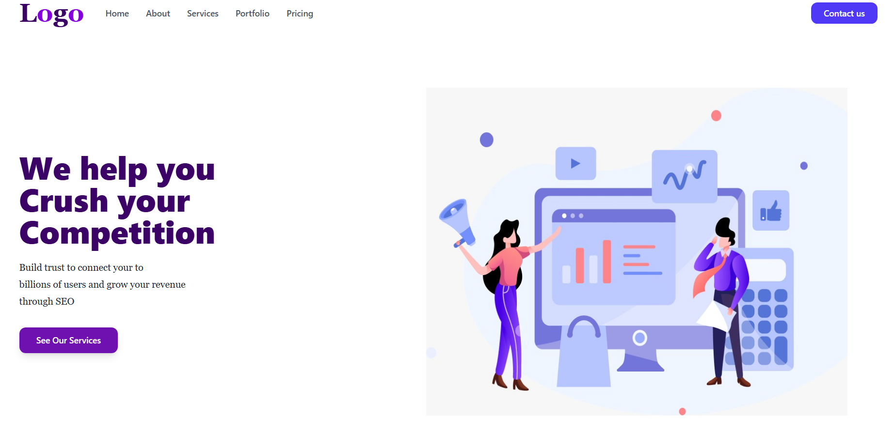

# 🚀 Business Landing Page

A modern, responsive business landing page built using **HTML**, **Tailwind CSS**, and **Font Awesome**. This project showcases a clean UI with a hero section, navigation bar, and mobile responsiveness.

## 📌 Features

* ✅ Fully responsive design (mobile + desktop)
* ✅ Styled with Tailwind CSS
* ✅ Modern navigation bar with hover effects
* ✅ Hero section with call-to-action button
* ✅ Font Awesome icons integration
* ✅ Clean and minimal UI

## 🛠️ Technologies Used

* HTML5
* Tailwind CSS (via CDN)
* Font Awesome (for icons)

[live](https://elbineldhose007.github.io/Buisness-Navbar-Responsive/)
## 📂 Project Structure

```
project-folder/
│
├── index.html
├── README.md
└── assets/
    └── image.jpeg
```

## ⚙️ Setup Instructions

1. Clone or download the project:

   ```bash
   git clone https://github.com/your-username/business-landing-page.git
   ```

2. Open the project folder:

   ```bash
   cd business-landing-page
   ```

3. Run the project:

   * Simply open `index.html` in your browser.

## 📱 Responsiveness

* Desktop: Full navigation menu visible
* Mobile: Hamburger menu icon appears
* Flexible layout using Tailwind’s responsive utilities

## 🎨 Customization

You can easily customize:

* Colors → Modify Tailwind classes (e.g., `bg-purple-800`)
* Text → Update headings and paragraph content
* Images → Replace the image file with your own
* Navigation links → Add real page links

## ⚠️ Notes

* Ensure your image path is correct:

  ```html
  
  ```
* Tailwind is used via CDN, so no installation required.

## 📈 Future Improvements

* Add working mobile menu toggle (JavaScript)
* Include additional sections (About, Services, Pricing)
* Improve accessibility (ARIA labels, semantic HTML)
* Add animations and transitions

## 📄 License

This project is open-source and free to use.

